# Agent Board — Architecture & Design

> How to coordinate multiple Claude Code agents through a shared ticket board, code review pipeline, and human interrupt system.

## Table of Contents

- [Problem Statement](#problem-statement)
- [Architecture](#architecture)
- [The Coordination Model](#the-coordination-model)
- [Ticket Lifecycle — Detailed Walkthrough](#ticket-lifecycle--detailed-walkthrough)
- [Blackboard — Signal Protocol](#blackboard--signal-protocol)
- [Human Control — Interrupt Levels](#human-control--interrupt-levels)
- [Branching & Code Review](#branching--code-review)
- [Sprint Ceremonies](#sprint-ceremonies)
- [Earned Autonomy Model](#earned-autonomy-model)
- [Comparison with Kapi Sprints](#comparison-with-kapi-sprints)
- [Failure Modes & Mitigations](#failure-modes--mitigations)

---

## Problem Statement

Claude Code can act as a specialist: a developer, a tester, a planner. But running multiple Claude Code instances on the same project creates coordination problems:

1. **Who works on what?** Without assignment, two agents pick the same file.
2. **In what order?** Features have dependencies — auth before OAuth, models before ingestion.
3. **How do they communicate?** Agent A discovers a problem that affects Agent B's work.
4. **When does the human step in?** Too much oversight kills throughput. Too little risks wrong outcomes.
5. **How do you stop everything?** When something goes wrong, you need an emergency brake.

The Agent Board solves these with three mechanisms: a **ticket state machine** (who does what, when), a **blackboard** (how agents communicate), and **human interrupt levels** (when and how you step in).

---

## Architecture

### Component Diagram

```mermaid
graph TB
    subgraph "Human Layer"
        H[Human]
        DASH["Dashboard<br/>http://localhost:3456"]
        CHAT["PM Chat<br/>(Chat tab)"]
        BOARD["/board CLI view"]
        HALT["/halt emergency stop"]
    end

    subgraph "Server Layer"
        SRV["server.js (Express)"]
        AUTH["auth.js<br/>GitHub OAuth + token encryption"]
        ORCHMAP["Orchestrators Map<br/>Map&lt;projectName, Orchestrator&gt;"]
        ORCHFOR["orchFor(req)<br/>resolves project → orchestrator"]
        CHATPROC["Chat Processes<br/>Map&lt;projectName, pty&gt;"]
    end

    subgraph "Agent Layer"
        PM["PM Agent<br/>/pm"]
        ARCH["Architect Agent<br/>/architect"]
        DEV["Dev Agent<br/>/dev"]
        REV["Reviewer Agent<br/>/reviewer"]
        TEST["Test Agent<br/>/test"]
    end

    subgraph "Data Layer (.agent-board/)"
        CFG["config.json<br/>Active project"]
        SC["schema.json<br/>Rules (shared)"]
        subgraph "projects/{name}/"
            BJ["board.json<br/>Tickets"]
            BB["blackboard.md<br/>Signals"]
            CJ["chat.json<br/>Chat history"]
            GT["github-token.enc<br/>OAuth token (encrypted)"]
            HI["history/<br/>Audit trail"]
            SP["sprints/current.json"]
        end
    end

    subgraph "Code Layer"
        MAIN["main branch<br/>(protected)"]
        FEAT["feature branches<br/>feat/TICKET-XXX"]
    end

    H --> DASH
    H --> CHAT
    H --> BOARD
    H --> HALT
    DASH -->|REST + SSE| SRV
    CHAT -->|REST + SSE| SRV
    SRV --> AUTH
    SRV --> ORCHMAP
    SRV --> ORCHFOR
    SRV --> CHATPROC
    AUTH -->|encrypt/decrypt| GT
    ORCHMAP -->|one per project| PM
    ORCHMAP -->|one per project| ARCH
    ORCHMAP -->|one per project| DEV
    ORCHMAP -->|one per project| REV
    ORCHMAP -->|one per project| TEST
    CHATPROC -->|claude -p| CHAT

    PM -->|creates/grooms tickets| BJ
    PM -->|posts findings| BB
    ARCH -->|validates design tickets| BJ
    ARCH -->|posts findings, decisions| BB
    ARCH -->|creates spike tickets| BJ
    DEV -->|claims tickets, updates status| BJ
    DEV -->|creates branches, writes code| FEAT
    REV -->|reviews code, merges PRs| FEAT
    REV -->|merges to main| MAIN
    TEST -->|validates on main| MAIN
    TEST -->|updates status, creates bugs| BJ

    PM -->|reads first| BB
    ARCH -->|reads first| BB
    DEV -->|reads first| BB
    REV -->|reads first| BB
    TEST -->|reads first| BB

    SC -.->|enforces| BJ
    CFG -.->|selects active| ORCHFOR
```

### Data Flow

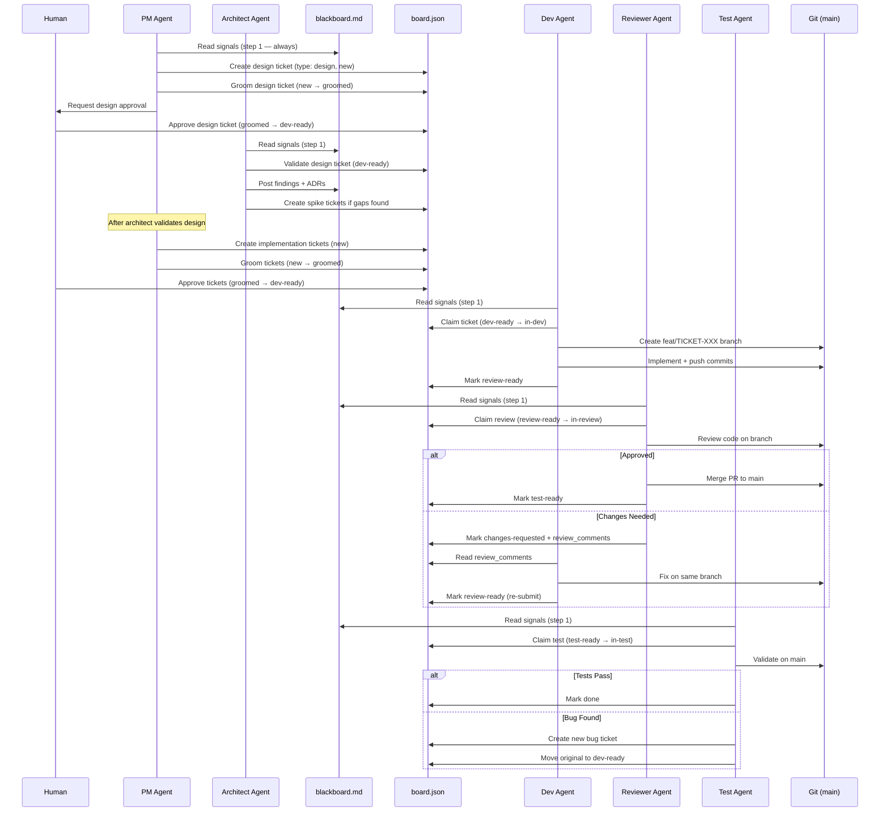

---

## The Coordination Model

### Why Tickets + Blackboard (Not Just One)

We use two coordination mechanisms because they solve different problems:

| | Tickets (board.json) | Blackboard (blackboard.md) |
|---|---|---|
| **Structure** | Highly structured — JSON with schema | Semi-structured — markdown signals |
| **Scope** | One ticket = one unit of work | Cross-cutting — affects multiple tickets |
| **Lifecycle** | Defined state machine with transitions | Append-only signal log |
| **Who reads it** | Agent assigned to that ticket | ALL agents, every loop |
| **Examples** | "Implement magic link auth" | "Spec is vague on token expiry — all auth tickets affected" |

**Why not just tickets?** Because some information doesn't belong to any single ticket. "The Strava API keys aren't configured" affects TICKET-004, TICKET-005, and future tickets. Putting that in one ticket's notes means other agents miss it.

**Why not just a blackboard?** Because emergent coordination doesn't scale. With 7+ tickets, agents need to know: which work is mine, what's the priority, what are the dependencies, what's the acceptance criteria. A flat signal board can't answer those questions.

The blackboard is the **nervous system** (signals). The ticket board is the **skeleton** (structure).

### Schema Enforcement

`schema.json` is the single source of truth for what's allowed:

```json
{
  "valid_transitions": {
    "in-dev": ["review-ready", "blocked", "halted"],
    ...
  },
  "agent_permissions": {
    "dev-agent": {
      "transitions": ["dev-ready→in-dev", "in-dev→review-ready", ...]
    },
    ...
  },
  "wip_limits": { "in-dev": 1, "in-review": 1, "in-test": 1 }
}
```

Agents are instructed to read the schema and only execute transitions they're permitted. WIP limits of 1 per stage prevent two agents from working in the same pipeline stage simultaneously.

> **Honest limitation:** There's no runtime enforcement. Agents follow the schema because they're instructed to, not because the system prevents violations. This is convention-enforced, not code-enforced. A future version could add a validation layer that rejects invalid board.json writes.

---

## Ticket Lifecycle — Detailed Walkthrough

### Design-First Workflow

Before creating implementation tickets, the PM agent creates a design/architecture ticket (TICKET-001, type "design") containing a mermaid architecture diagram and tech stack as acceptance criteria. The human must approve this design ticket before the PM creates backlog stories. The "design" type is a valid ticket type in `schema.json`.

Once the design ticket is approved (moved to `dev-ready`), the **Architect Agent** validates it — checking tech stack completeness, component boundaries, data flow, storage needs, API design, and security. The architect posts findings and Architecture Decision Records (ADRs) to the blackboard, and can create spike tickets for areas needing investigation. Only after the architect validates the design does the PM create implementation tickets.

### The Happy Path

```
1. PM agent reads spec, creates TICKET-001 design ticket (status: new, type: design)
2. PM agent grooms design ticket with architecture diagram + tech stack (status: groomed)
3. Human approves design ticket (status: dev-ready) ← HUMAN GATE
4. Architect agent validates design — posts findings/ADRs to blackboard
5. PM agent creates TICKET-002 implementation ticket (status: new)
6. PM agent adds acceptance criteria, test cases (status: groomed)
7. Human reviews and approves (status: dev-ready) ← HUMAN GATE
8. Dev agent claims it, creates branch feat/TICKET-002-magic-link (status: in-dev)
9. Dev agent implements, pushes branch (status: review-ready)
10. Reviewer agent reviews code on branch (status: in-review)
11. Reviewer approves, merges to main (status: test-ready)
12. Test agent validates against acceptance criteria (status: in-test)
13. All tests pass (status: done) ✓
```

### The Review Feedback Loop

```
6. Reviewer finds problems:
   - "auth/magic_link.py:45 — no error handling for expired token"
   - "Missing test for expired token from acceptance criteria"
7. Reviewer sets status: changes-requested with review_comments
8. Dev agent reads review_comments, checks out same branch
9. Dev fixes exactly what was requested, pushes to same branch
10. Dev sets status: review-ready (re-submit)
11. Reviewer reviews new commits only
12. Reviewer approves, merges (status: test-ready)
```

### The Bug Path

```
8. Test agent runs tests, discovers: token expiry returns 500 instead of 401
9. Test agent creates BUG-001 (new ticket, type: bug, linked to TICKET-002)
10. Test agent moves TICKET-002 back to dev-ready
11. Dev agent picks up BUG-001 (or TICKET-002 if it re-enters the pipeline)
```

### The Blocked Path

```
4. Dev agent claims TICKET-004 (Strava OAuth)
5. Dev discovers: Strava API keys aren't configured in .env
6. Dev sets status: blocked, posts blocker to blackboard
7. Human reads blackboard, configures API keys
8. Human (or dev agent) moves ticket back to in-dev
9. Dev resumes on the same branch
```

---

## Blackboard — Signal Protocol

### Format

Every signal follows this format in `blackboard.md`:

```markdown
## [signal-type] Title — agent-role — ISO-timestamp
Detail about what was found/decided/blocked.
Affects: TICKET-XXX, TICKET-YYY
```

### Signal Types

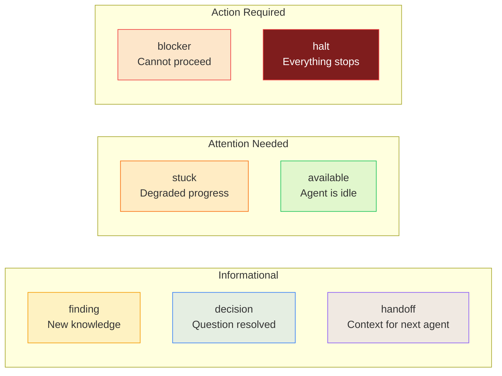

### Agent Read Priority

Every agent's loop starts the same way:

```
1. Read blackboard.md
2. If [halt] exists → STOP. Do nothing. Wait for human.
3. If [blocker] affects my ticket → skip it, pick another
4. If [finding] is relevant → adjust my approach
5. Proceed to pick work from board.json
```

The blackboard is the interrupt mechanism. A signal posted to the blackboard reaches every agent on their next loop iteration. This is **polling-based** — agents check the blackboard, they aren't notified in real-time.

---

## Human Control — Interrupt Levels

Six levels, from lightest touch to full stop:

### Level 1: Nudge (Post a finding)

You discovered something agents should know. Post a `finding` to the blackboard. Agents read it and adjust their behavior on their next loop.

**Example:** "The Strava API rate limit is 100 req/15min — dev agent should add throttling to TICKET-005."

**Effect:** Informational. Agents are not required to stop.

### Level 2: Redirect (Reprioritize)

Change a ticket's priority in board.json. The next agent looking for work picks the new highest-priority ticket instead.

**Example:** "Reprioritize TICKET-006 to critical — we can't do anything without the data models."

**Effect:** Changes what gets worked on next. No work is stopped.

### Level 3: Block (Post a blocker)

Something prevents a ticket from proceeding. Post a `blocker` to the blackboard naming specific tickets. Agents skip blocked tickets.

**Example:** "Post a blocker on TICKET-004 and TICKET-005 — Strava API keys not configured."

**Effect:** Named tickets can't be claimed. Other work continues.

### Level 4: Override (Force a review decision)

The reviewer agent approved or rejected a PR, but you disagree. Override the decision.

**Example:** "Force block the merge on TICKET-002 — I want to review the auth flow myself."

**Effect:** Overrides agent judgment. Human outranks all agents.

### Level 5: Recall (Move to backlog)

Pull a ticket out of the sprint entirely. The agent saves work-in-progress to the branch.

**Example:** "Move TICKET-007 back to backlog — metrics can wait for Sprint v2."

**Effect:** Ticket exits the sprint. Agent moves to next available work.

### Level 6: Halt (Emergency stop)

Run `/halt`. All in-progress tickets move to `halted`. All agents stop on their next loop. Sprint status changes to `halted`. Nothing moves until the human explicitly resumes.

**Example:** "Wrong approach on the auth system — need to regroup before anyone writes more code."

**Effect:** Everything stops. Nuclear option.

---

## Branching & Code Review

### Why Branches?

Without branches, multiple dev agents writing to `main` simultaneously creates merge conflicts, broken builds, and untraceable bugs. Each ticket gets its own branch:

```
main (protected — no direct commits)
├── feat/TICKET-001-fix-skeleton-crashes
├── feat/TICKET-002-magic-link-auth
├── fix/BUG-001-token-expiry-check
└── feat/TICKET-006-missing-tables
```

### The Review Gate

Code review exists between development and testing for three reasons:

1. **Catch quality issues early** — before they reach the test agent and generate bug tickets
2. **Protect main** — only reviewed, approved code gets merged
3. **Separation of concerns** — building, reviewing, and testing are three different skill sets

```
Dev Agent     → "I built the feature + updated relevant docs"
Reviewer      → "The code is clean, secure, follows patterns"
Test Agent    → "The feature works correctly — wrote + executed tests against acceptance criteria"
```

### Agent Responsibilities Beyond Code

**Dev Agent — Documentation:**
The dev agent updates relevant documentation as part of each ticket. If it adds/changes an API endpoint, it updates the corresponding docs. If it adds a new module, it writes inline docstrings. No separate doc tickets needed — docs ship with the code.

**Test Agent — Test Writing & Execution:**
The test agent doesn't just validate — it actively writes test files:
1. Reads acceptance criteria and `test_cases` from the ticket (PM-defined)
2. Writes actual test code (pytest files, integration tests)
3. Executes them against the merged code on main
4. Reports pass/fail with specific results in the ticket's `test_cases` array
5. Creates `BUG-XXX` tickets for failures with reproduction steps

### Review Comments Format

When the reviewer requests changes, it writes specific, actionable feedback:

```json
{
  "review_comments": [
    "auth/magic_link.py:45 — no error handling for expired token, returns 500 instead of 401",
    "Missing test: verify with expired token (>15 min) from acceptance criteria",
    "config.py:12 — FERNET_KEY loaded but never validated at startup"
  ]
}
```

Rules: file name + line number + exact problem + what to fix. Not "the code needs improvement."

---

## Sprint Ceremonies

### Sprint Planning (Human + PM Agent)

**When:** Before sprint starts.

**Flow:**
1. PM agent grooms tickets from the spec
2. PM agent posts findings to the blackboard
3. Human reviews groomed tickets and acceptance criteria
4. Human approves tickets to `dev-ready` (the gate)
5. Sprint status moves from `planning` to `active`

**Always human because:** Sprint scope is a business decision.

### Sprint Review (Human + All Agents)

**When:** All tickets done or timebox expired. Run `/review`.

**Flow:**
1. `/review` command generates a report: delivered, carried over, bugs found, velocity
2. Human evaluates: does this match intent, not just acceptance criteria?
3. Human accepts or rejects delivered work
4. Carried-over tickets are moved to next sprint or backlog

**Always human because:** Acceptance requires judgment beyond criteria.

### Retrospective (Human + All Agents)

**When:** After sprint review. Run `/retro`.

**Flow:**
1. `/retro` analyzes: cycle time, review cycles, blocker duration, blackboard health
2. Proposes process changes: schema updates, WIP limit changes, new ceremonies
3. Human approves or modifies proposals
4. Approved changes are applied to `schema.json`
5. Sprint closes. Next sprint planning begins.

**Always human because:** The retro improves the system itself.

---

## Earned Autonomy Model

Based on Sheridan's Autonomy Levels and Kapi Sprints' HITL philosophy.

### The Principle

Start with full human oversight. As agents prove reliable, reduce oversight gradually. Never fully remove the human from judgment calls.

### The Ramp

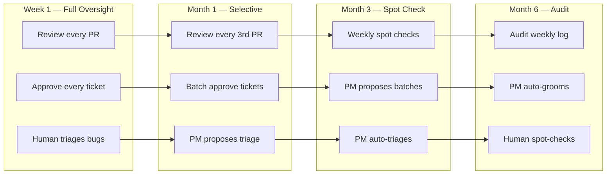

### What Never Gets Automated

These require human judgment regardless of agent reliability:

- **Sprint planning** — business priorities change
- **Sprint review** — intent vs criteria is a human judgment
- **Retrospective** — process changes affect the system itself
- **Deploy decision** — production deployment is irreversible
- **Blocker resolution** — by definition, agents can't solve these

### Bainbridge's Irony

> "The more reliable the automation, the less the human operator practices, and the worse they perform when they need to intervene."

This is why we keep the human in sprint ceremonies even when agents are performing well. The human needs to stay engaged with the system to make good intervention decisions when things go wrong.

---

## Orchestrator — Automated Agent Management

### Why an Orchestrator?

Without an orchestrator, you manually open 5 terminals, type `/pm`, `/architect`, `/dev`, `/reviewer`, `/test`, and watch them work. The orchestrator automates this: it watches `board.json`, detects when work is available for each agent role, and spawns Claude Code in headless mode to do the work. Each project gets its own `Orchestrator` instance — the server maintains a `Map<projectName, Orchestrator>` for full project isolation.

### Target Repository Support

Projects can configure a separate git repository for code artifacts via `"repo": {url, branch, cloned}` in `board.json`. When configured, the orchestrator clones the target repo on first agent run and creates worktrees from the clone. The `.agent-board/` directory is symlinked into each worktree so agents share board state. Authentication uses GitHub OAuth (see below) or the host machine's git credentials.

### GitHub OAuth Authentication

SwarmBoard integrates GitHub OAuth so agents can clone and push to private repositories without requiring SSH keys or manual credential setup on the host machine.

#### Architecture

```
dashboard/auth.js         — Passport GitHub OAuth strategy, token encryption/storage
dashboard/server.js       — Mounts auth routes + project-level GitHub API endpoints
dashboard/orchestrator.js — getGitEnvWithAuth() injects token into agent child processes
```

#### OAuth Flow

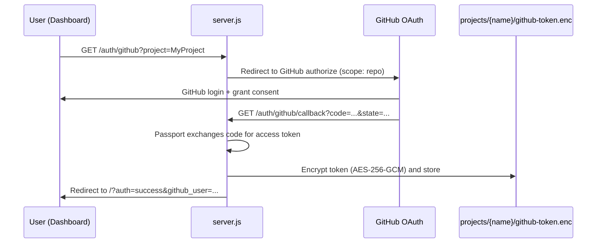

#### Token Storage & Encryption

Tokens are encrypted at rest using the same AES-256-GCM pattern as project secrets:

- **Key derivation:** `scrypt(hostname + salt)` where the salt lives in `.agent-board/.secrets-key`
- **Storage location:** `projects/{name}/github-token.enc` (per-project, JSON with iv + authTag + ciphertext)
- **Token data:** access token, GitHub profile (username, id), connection timestamp, scope

The token is never stored in plaintext, never embedded in remote URLs, and never passed in agent command-line arguments.

#### GIT_ASKPASS Mechanism

When an agent needs git access (clone, fetch, push), the orchestrator provides credentials without exposing the token in process arguments or environment variable values visible to `ps`:

1. `getGitEnvWithAuth()` decrypts the token from `github-token.enc`
2. Writes a temp shell script to `projects/{name}/.tmp/git-askpass-{pid}.sh` that echoes the token
3. Sets `GIT_ASKPASS` and `GIT_TERMINAL_PROMPT=0` in the agent's child process environment
4. Git calls the askpass script when authentication is needed (HTTPS clone/push)
5. Temp scripts are tracked and cleaned up via `cleanupAskpassFiles()` on process exit

This means agents transparently authenticate to GitHub — no token in remote URLs, no `git credential` configuration needed.

#### API Endpoints

| Route | Method | Purpose |
|---|---|---|
| `/auth/github` | GET | Initiate OAuth flow (accepts `?project=`) |
| `/auth/github/callback` | GET | OAuth callback — stores encrypted token |
| `/auth/status` | GET | Check if GitHub is connected for a project |
| `/auth/disconnect` | POST | Remove stored token for a project |
| `/api/projects/github-status` | GET | Project-level GitHub connection status (dashboard UI) |
| `/api/github/repos` | GET | List user's GitHub repos (used by repo picker) |
| `/api/projects/github-disconnect` | POST | Disconnect GitHub for a project |

#### Graceful Degradation

If `GITHUB_CLIENT_ID` and `GITHUB_CLIENT_SECRET` are not set, `auth.js` registers stub routes that redirect with `?auth=not_configured`. The dashboard shows a "not configured" state in the GitHub Connection panel. Agents fall back to whatever git credentials are configured on the host (SSH keys, credential helpers).

#### Dashboard UI

- **Human Control tab** — GitHub Connection panel: shows connected username or "Connect GitHub" button
- **Repo Config modal** — when GitHub is connected, shows a searchable repo picker populated from the GitHub API
- **Header indicator** — shows the connected GitHub username when authenticated

### How It Works

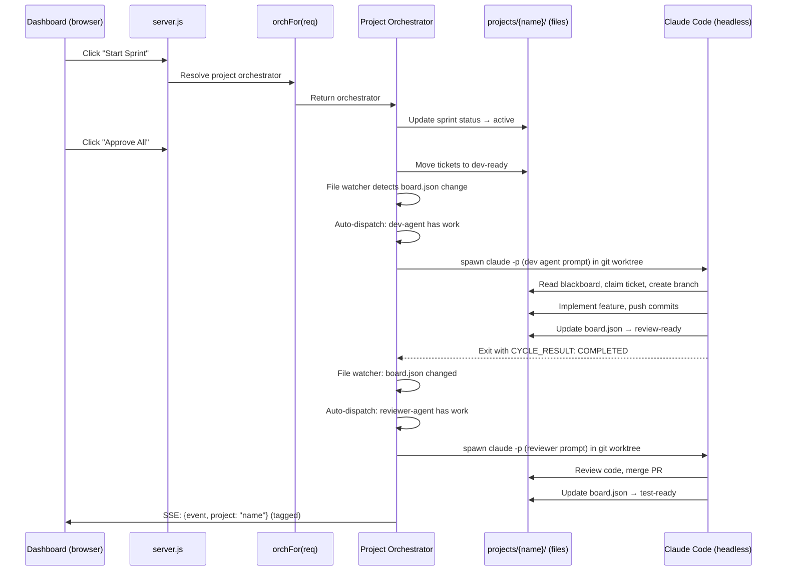

### Claude Code Headless Mode

Each agent is spawned as:

```bash
claude -p "<agent prompt with full command instructions>" \
  --output-format stream-json \
  --allowedTools "Read,Write,Edit,Bash" \
  --max-turns 30
```

Key flags:

- `--output-format stream-json` — the orchestrator receives real-time JSON messages as the agent works (tool calls, text output, cost tracking)
- `--allowedTools` — each agent gets different tool permissions (reviewer doesn't need full Bash, PM doesn't need Write)
- `--max-turns` — prevents runaway agents from consuming unlimited API calls
- `--resume {session_id}` — when restarting an agent, it can continue from its previous session for context continuity

### Dashboard Features

The dashboard (`http://localhost:3456`) provides:

- **Swim-lane Kanban** — all 11 ticket states as columns, tickets as cards with priority colors
- **Agent status** — live dots for PM, ARCH, DEV, REV, QA (green=running, yellow=has-work, gray=idle, red=error), Start/Stop buttons
- **Human controls** — Start Sprint, Reset Sprint, Approve All, Toggle Auto-Dispatch, Post Signal, Halt/Resume
- **Ticket modals** — click any ticket → "Move to" dropdown with all valid statuses, approve, block
- **Agent safety** — moving an assigned ticket warns the human and stops the agent with confirmation
- **Blackboard panel** — latest signals color-coded by type
- **Agent log** — real-time feed of what agents are doing
- **PM Chat** — conversational PM agent for spec design, ticket actions, and project creation
- **Project switcher** — switch between projects; agents on other projects keep running
- **SSE real-time updates** — dashboard auto-refreshes via Server-Sent Events with project-scoped filtering

### Human Override — Move Any Ticket

The dashboard gives the human full override authority to move any ticket to any status. This is critical for course-correcting mid-sprint. All requests include a `project` parameter so the correct orchestrator is resolved.

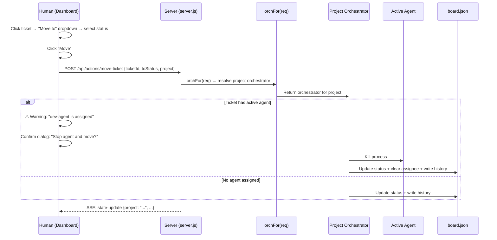

### Sprint Reset Flow

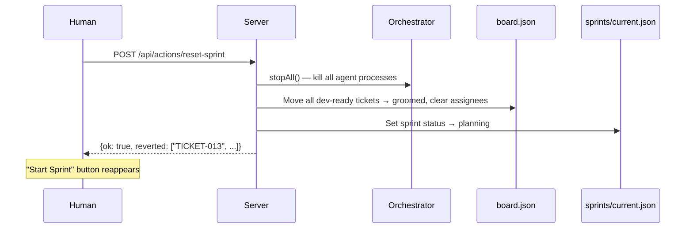

### Auto-Dispatch Logic

When auto-dispatch is ON, the orchestrator:

1. Watches `board.json` for changes (via chokidar file watcher)
2. On change: refreshes state, checks which agents have work available
3. For each idle agent with matching trigger statuses → spawns a new cycle
4. Agent completes → orchestrator waits 3 seconds → checks for more work → respawns if available
5. After 3 consecutive cycles with no work → agent goes idle (stops restarting)
6. If sprint is halted → refuses to spawn any agents

### Important: Runs on Host, Not Docker

The orchestrator runs directly on your machine because it needs to:

- Spawn `claude` as child processes (which need your Anthropic API key)
- Access your project directory and git configuration
- Read/write `.agent-board/` files that agents also modify

Your project's own services (db, backend, frontend, etc.) may run in Docker or elsewhere. The orchestrator runs on the host alongside them.

---

## Per-Project Architecture

SwarmBoard supports multiple independent projects, each with its own orchestrator, agents, board, and sprint state. The server maintains a `Map<projectName, Orchestrator>` and resolves the correct orchestrator for each request.

### Orchestrator Resolution

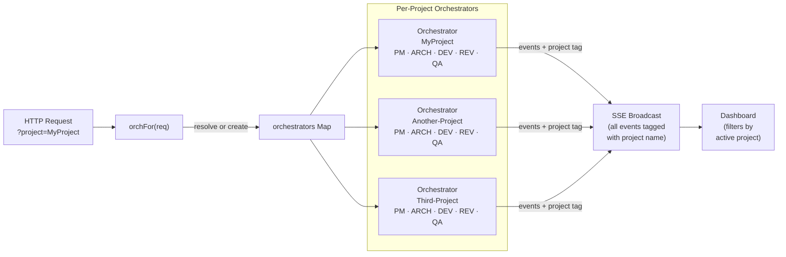

### Key design decisions

- **Lazy creation** — orchestrators are created on first access via `getOrCreateOrchestrator()`, not at server startup
- **Shared schema** — `schema.json` (state machine rules, WIP limits) lives at the `.agent-board/` root and is shared across all projects
- **Independent lifecycle** — switching the active project in the dashboard doesn't stop agents on other projects
- **SSE project tags** — all SSE events include a `project` field; the dashboard UI filters events to show only the active project

### Cross-Project Rate Limiting

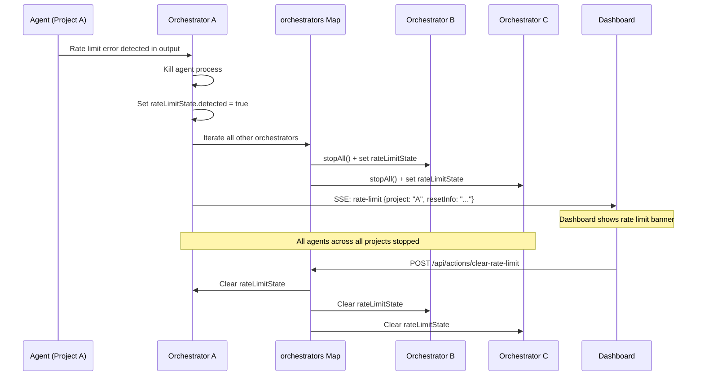

Rate limiting is account-level (Anthropic API), so when one agent hits a limit, all agents everywhere must stop to avoid burning retries.

---

## PM Chat System

The Chat tab provides a conversational interface with a PM agent. Each project has its own chat process and history.

### Chat Flow

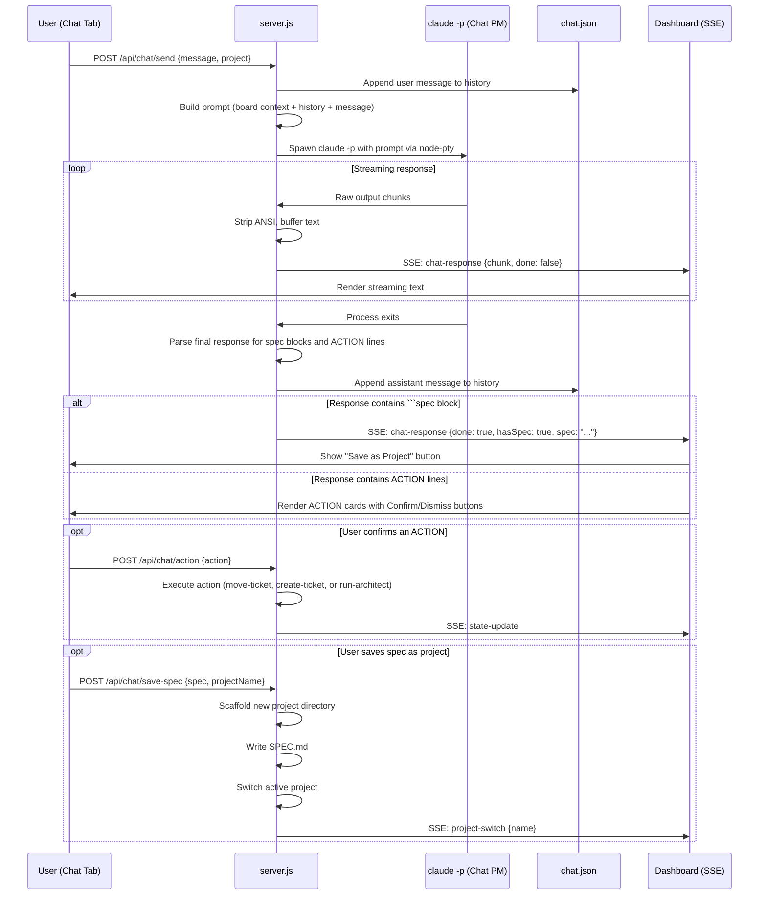

### Chat prompt construction

The PM chat prompt includes:
1. Role instructions (PM agent responsibilities)
2. Technology & architecture discussion guidelines (design-first workflow)
3. Architect agent integration (how to trigger architect validation, create spike tickets)
4. Current board state (ticket summary)
5. Existing spec content (if any)
6. Chat history (previous messages)
7. The new user message
8. Instructions for ACTION output format (move-ticket, create-ticket, run-architect) and spec block format

---

## Multi-Project Data Flow

### Project Data Layout

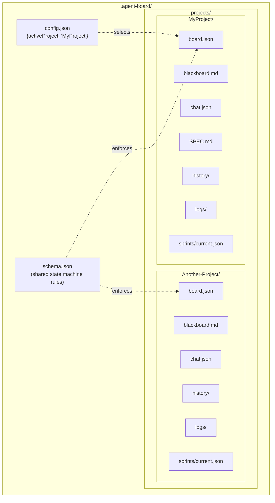

### Project lifecycle

1. **Creation** — `POST /api/projects/create` or "Save as Project" from PM Chat scaffolds the directory structure
2. **Migration** — on first run, existing single-project data is auto-migrated into `projects/{name}/`
3. **Switching** — `POST /api/projects/switch` updates `config.json` and re-points the file watcher
4. **Isolation** — each project has completely independent agents, board state, and sprint lifecycle

---

## Comparison with Kapi Sprints

| Aspect | Kapi Sprints | SwarmBoard |
|--------|-------------|-----------------|
| **Coordination** | Blackboard signals (emergent) | Ticket state machine (explicit) + blackboard |
| **Storage** | Scattered markdown files | Single board.json + schema.json |
| **State transitions** | Convention via prompts | Defined in schema, enforced by instructions |
| **Code review** | Not built in | Reviewer agent with merge gate |
| **Branching** | Not built in | Branch per ticket, main protected |
| **Human control** | Edit markdown files | 6 interrupt levels + /halt + /board CLI |
| **Sprint ceremonies** | Mentioned in skills | /review and /retro commands |
| **Earned autonomy** | Conceptual (review rate decay) | Defined in schema.json with timeline |
| **Multi-project** | Single project | Per-project orchestrators, isolated boards, project switching |
| **Chat** | Not built in | PM Chat with spec generation, ACTION cards, project creation |
| **Architect role** | Not built in | Dedicated architect agent validates design, creates ADRs and spike tickets |
| **Dashboard** | Next.js web app (read-only) | Web dashboard (Express + SSE) with full human control |

### Design Influences from Kapi

SwarmBoard builds on ideas from the Kapi Sprints framework:

- **Kept:** Signal taxonomy (finding, decision, blocker, stuck, handoff, available), blackboard-first agent loop, earned autonomy concept (Sheridan's levels), HITL philosophy (Bainbridge's Irony)
- **Added:** Structured ticket state machine, schema enforcement, architect agent (design validation, ADRs, spike tickets), code review pipeline (reviewer agent), branch-per-ticket workflow, 6-level human interrupt system, executable sprint ceremonies, web dashboard with full override authority, per-project orchestrator isolation, PM Chat with ACTION cards, multi-project support

---

## Failure Modes & Mitigations

| Failure | What Happens | Mitigation |
|---------|-------------|------------|
| **Two agents claim same ticket** | Both write to board.json, last write wins | WIP limits of 1 per stage; agents check assignee before claiming |
| **Concurrent board.json writes** | File corruption or lost updates | Single-threaded by design (one agent per stage); future: file locking |
| **Agent ignores schema** | Invalid transition executed | Agents read schema first; history provides audit trail for detection |
| **Agent ignores blackboard** | Works on blocked/halted ticket | Agent commands mandate "read blackboard FIRST"; human can /halt |
| **Infinite review loop** | Reviewer keeps requesting changes | Human monitors review cycle count in /retro; can override |
| **Agent creates bad tests** | Test agent passes invalid code | Human reviews in sprint review ceremony; earned autonomy ramp |
| **Blocker posted, no human available** | Agents idle on blocked tickets | Agents skip blocked tickets and pick other available work |
| **Sprint scope too large** | Nothing reaches done | Retro analyzes velocity and proposes smaller scope for next sprint |
| **Human moves ticket with active agent** | Agent and board desync | Dashboard warns, confirms, and stops agent before moving ticket |
| **Sprint needs full reset** | Stuck in bad state | Reset Sprint button: stops agents, reverts all active tickets → groomed, returns to planning |
| **Rate limit hits one project** | All agents burning retries | Cross-project rate limiting: all orchestrators stop, dashboard shows rate limit banner |
| **Chat ACTION executed incorrectly** | Wrong ticket moved/created | ACTION cards require explicit user confirmation before execution |
| **GitHub token expired/revoked** | Agent git operations fail (clone, push) | Dashboard shows connection status; user re-authenticates via GitHub Connection panel; agents fall back to host credentials |

> **Core principle:** No failure should be silent. Every state change is logged to history. Every cross-cutting issue goes to the blackboard. The human sees everything in `/board` and sprint ceremonies.
